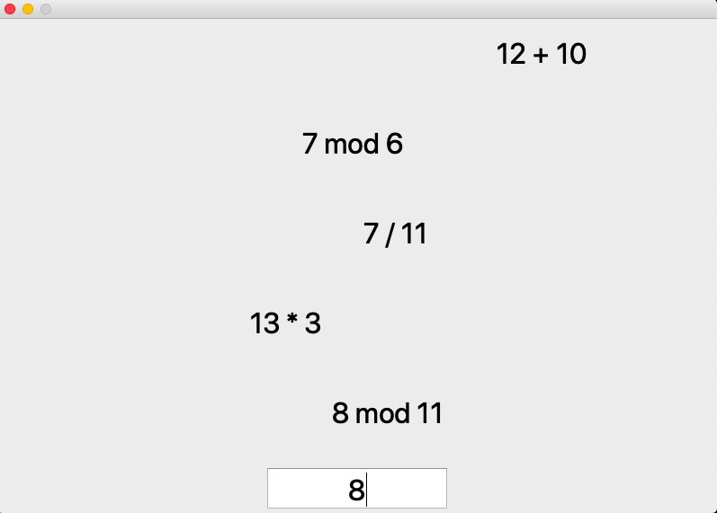

# elementarymath
A little Qt application to practice elementary math operations



## install and run
```
$git clone https://github.com/keszegrobert/elementarymath.git
$cd elementarymath
$python main.py
```


